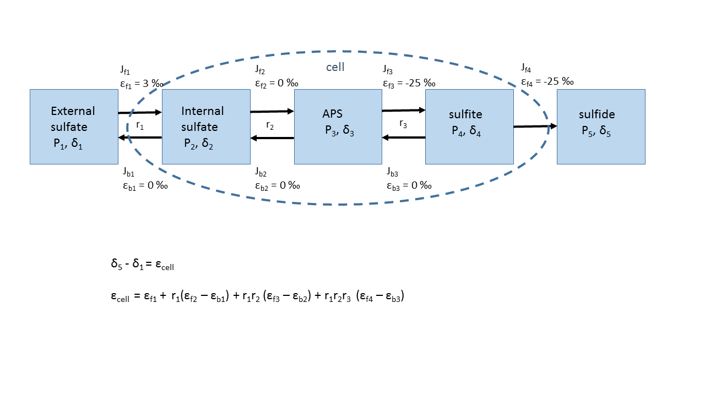
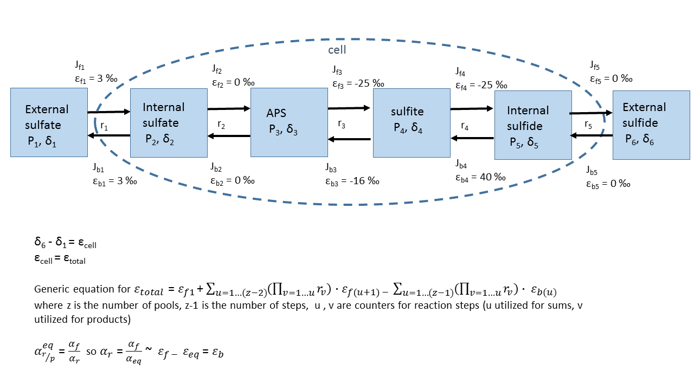

```{r "setup", warning=FALSE, message=FALSE}
library(tidyverse)
library(plotly)
```

```{r, out.width = "100%", echo=FALSE, eval=TRUE}
 
```

##Example 1: Rees Model with varying reversibility 

```{r "Rees model"}
# constants
eps_f1 <- 3 
eps_f2 <- 0
eps_f3 <- -25
eps_f4 <- -25
eps_b1 <- 0
eps_b2 <- 0
eps_b3 <- 0


# grid of variables
data1 <- expand.grid(
  r_1 = seq(0, 1, by = 0.01),
  r_2 = seq(0, 1, by = 0.01),
  r_3 = c(0.0, .25, .5, .75, 1)
  ) %>% as_data_frame() %>% mutate(
  delta_SO4 = 21,
  eps_cell = eps_f1 + r_1*(eps_f2 - eps_b1) + r_1*r_2*(eps_f3 - eps_b2) + r_1*r_2*r_3*(eps_f4 - eps_b3),
  delta_sulfide = delta_SO4 + eps_cell
  ) 

# show the data
data1 %>% head() %>% knitr::kable()

```

## Visualize

```{r "plot Rees"}
base_plot <- ggplot() +
  aes(x = r_1, y = r_2, z = eps_cell) +
  geom_contour(aes(colour = ..level..), binwidth = 0.1) + 
  scale_color_gradientn(name = latex2exp::TeX("$\\epsilon_{cell}"), 
                        colours = rainbow(5),
                        labels = function(x) paste(x, "\u2030")) +
  scale_y_continuous(breaks = (0:10)*0.1, name = latex2exp::TeX("$r_{2}$"), expand = c(0,0), labels = function(x) paste(100*x, "%")) +
  scale_x_continuous(name = latex2exp::TeX("$r_{1}$"), expand = c(0,0), labels = function(x) paste(100*x, "%")) +
  expand_limits(y = 0, x = 0) +
  theme_bw() + 
  facet_grid(~r_3_panel_factor)


p <- base_plot %+% (
  data1 %>% 
    mutate(
      r_3_panel = paste0("r_3: ", 100*r_3, "%"),
      r_3_panel_factor = factor(r_3_panel, levels = unique(r_3_panel))
    ) 
)

p
```

Under what conditions is there a minimal isotope effect of sulfate reduction? Under what conditions is there a maximal isotope effect? What is rate-limiting under each of these conditions? 


##Using plotly to create interactive graphs
```{r "ggplotly"}
ggplotly(p, tooltip = c("x", "y"))
```

##3D options!
```{r "plotly 3D"}
#3D scatter plot with fourth dimension as color
plot_ly(data1, x = ~r_1, y = ~r_2, z = ~r_3, 
        marker = list(color = ~eps_cell, colorscale = c('#FFE1A1', '#683531'), showscale = TRUE)) %>%
  add_markers() %>%
  layout(scene = list(xaxis = list(title = 'R_1'),
                     yaxis = list(title = 'R_2'),
                     zaxis = list(title = 'R_3')),
         annotations = list(
           x = 1,
           y = 1,
           text = 'Epsilon cell',
           xref = 'paper',
           yref = 'paper',
           showarrow = FALSE
         ))
```

##Example 2:
What is the maximal isotope effect that can be achieved using the Rees model? Assuming a $\delta^{34}S_{sulfate}$ of 21 per mil for seawater, what is the isotopic composition of biogenic sulfide produced under conditions corresponding to the maximum potential isotope effect? How does this compare to observed values from the environment?

```{r "Example 2- Find the Max"}
data1 %>% filter(eps_cell == min(eps_cell))
```


##Exercise 1: Modifying Rees Model to allow for isotopic fractionation in reverse



We will modify the Rees model to add an internal sulfide pool. We will allow for reversibility between sulfite and internal sulfide pools as well as between internal and external sulfide pools. We will also assign an isotope effect to reverse fluxes. This reverse isotope effect is calculated using the measured kinetic effects of forward fluxes and the equilibrium isotope effect. $\epsilon_{b} = \epsilon_{f} - \epsilon_{eq}$. 

According to this relationship, what is one major caveat of the original Rees model? Using the general formula for linear multi-step reactions with reversibility, write out the formula for $\epsilon_{cell}$. We will utilize reversibilities of 1 for $r_2$ and $r_5$, as there is no isotope effect associated with these steps. Now what is the magnitude of the maximal isotope effect? At what reversibilities does this occur? How does this compare with observed values? 


```{r "modified Rees model"}
# constants
eps_f1 <- 3 
eps_f2 <- 0
eps_f3 <- -22
eps_f4 <- -25
eps_f5 <- 0
eps_eq1 <- 0
eps_eq2 <- 0
eps_eq3 <- -6
eps_eq4 <- -65
eps_eq5 <- 0
eps_b1 <- eps_f1 - eps_eq1
eps_b2 <- eps_f2 - eps_eq2
eps_b3 <- eps_f3 - eps_eq3
eps_b4 <- eps_f4 - eps_eq4
eps_b5 <- eps_f5 - eps_eq5


# grid of variables
data2 <- expand.grid(
  r_1 = seq(0, 1, by = 0.01),
  r_3 = seq(0, 1, by = 0.01),
  r_4 = c(0, .25, .5, .75, 1)
  ) %>% as_data_frame() %>% mutate(
  r_2 = 1,
  r_5 = 1,
  delta_SO4 = 21,
  eps_cell = eps_f1 + r_1*(eps_f2 - eps_b1) + r_1*r_2*(eps_f3 - eps_b2) + r_1*r_2*r_3*(eps_f4 - eps_b3) ...???,
  delta_sulfide = 21 + eps_cell
  ) 

#plot
base_plot %+% (
  data2 %>% 
    mutate(
      r_4_panel = paste0("r_4: ", 100*r_4, "%"),
      r_4_panel_factor = factor(r_4_panel, levels = unique(r_4_panel))
    ) 
) %+% aes(x = r_1, y = r_3, z = eps_cell) +
  scale_y_continuous(breaks = (0:10)*0.1, name = latex2exp::TeX("$r_{3}$"), expand = c(0,0), labels = function(x) paste(100*x, "%")) +
  facet_grid(~r_4_panel_factor)

data2 %>% filter(eps_cell == min(eps_cell))
```

##Exercise 2.1:
For each backward flux, is the isotope effect normal or inverse?

```{r}

```

##Exercise 2.2:
What happens to the total isotope effect of the cell if $\epsilon_{b4}$ is negative? At what reversibilities is the isotope effect maximal? Assuming the equilibrium and forward isotope effects of sulfite reduction are correct, why is the total isotope effect of sulfate reduction so large?

```{r}
eps_b4 = ???

data3 <- expand.grid(
  r_1 = seq(0, 1, by = 0.01),
  r_3 = seq(0, 1, by = 0.01),
  r_4 = c(0, .25, .5, .75, 1)
  ) %>% as_data_frame() %>% mutate(
  r_2 = 1,
  r_5 = 1,
  delta_SO4 = 21,
  eps_cell = eps_f1 + r_1*(eps_f2 - eps_b1) + r_1*r_2*(eps_f3 - eps_b2) + r_1*r_2*r_3*(eps_f4 - eps_b3) + r_1*r_2*r_3*(eps_f4 - eps_b3) + r_1*r_2*r_3*r_4*(eps_f5 - eps_b4) + r_1*r_2*r_3*r_4*r_5*(-eps_b5),
  delta_sulfide = 21 + eps_cell
  ) 

#plot
base_plot %+% (
  data3 %>% 
    mutate(
      r_4_panel = paste0("r_4: ", 100*r_4, "%"),
      r_4_panel_factor = factor(r_4_panel, levels = unique(r_4_panel))
    ) 
) %+% aes(x = r_1, y = r_3, z = eps_cell) +
  scale_y_continuous(breaks = (0:10)*0.1, name = latex2exp::TeX("$r_{3}$"), expand = c(0,0), labels = function(x) paste(100*x, "%")) +
  facet_grid(~r_4_panel_factor)

data3 %>% filter(eps_cell == min(eps_cell))
```

